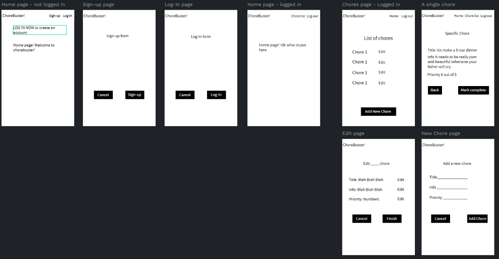
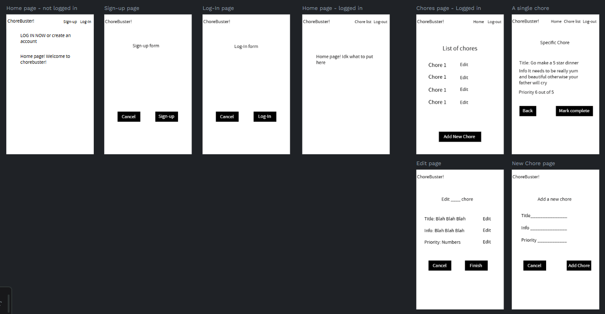
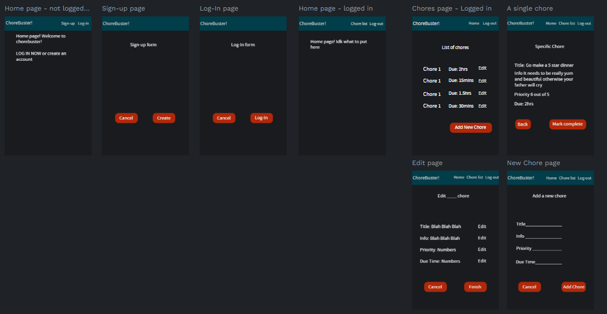
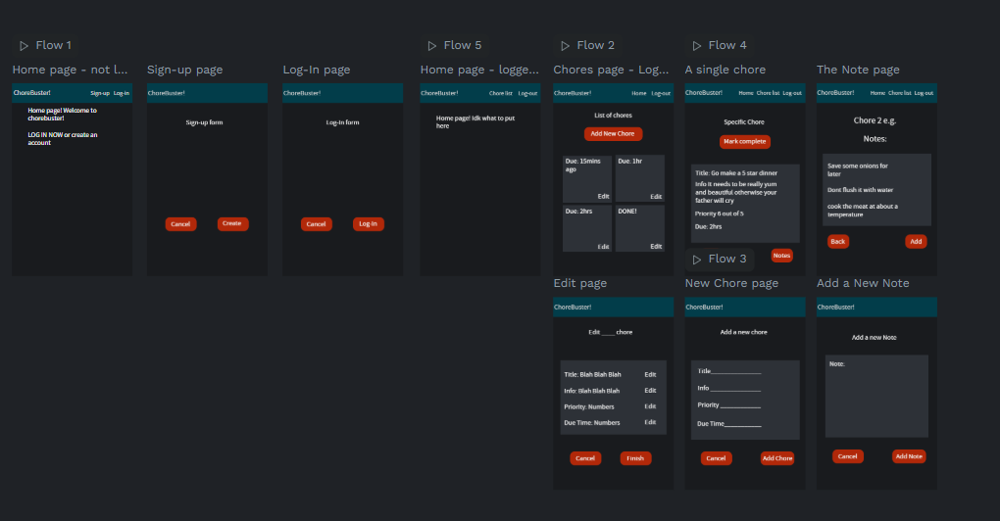
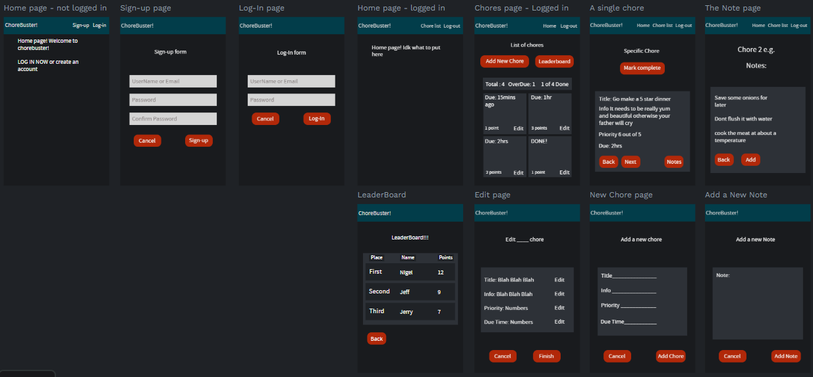
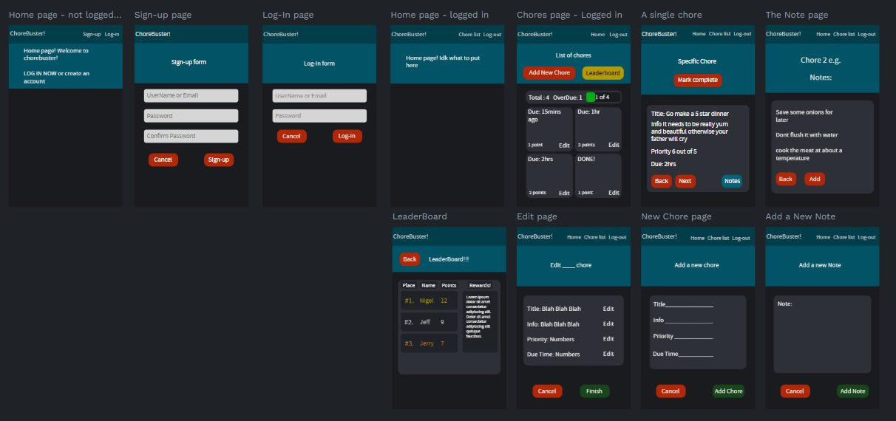

# Sprint 1 - Developing a DB and UI Prototype

## Sprint Goals

Develop a design for the database and a UI prototype that simulates the key functionality of the system. Test and refine the UI so that it can serve as the model for the next phase of development in Sprint 2.

### Specific Goals

**Edit these goals as needed**

- Design the database:
    - Tables
    - Fields / types
    - Primary keys
    - Default / nullable values
    - Relationships (foreign keys)
- Design the UI
    - Key pages
    - User interactions and 'flow'
    - Page layouts / features
    - Colour palette
    - Etc.

## Initial Database Design

Replace this text with notes regarding the DB design.

### Required Data Input

Replace this text with a description of what data will be input, and where / how it will be obtained.

### Required Data Output

Replace this text with a description of the outputs for the system - what types of data will be displayed?

### Required Data Processing

Replace this text with a description of how the data will be processed to achieve the desired output(s) - any processes / formulae?

## UI 'Flow'

The first stage of prototyping was to explore how the UI might 'flow' between states, based on the required functionality.

This Figma demo shows the initial design for the UI 'flow':

[UI Flow First Layout](https://design.penpot.app/#/workspace?team-id=f0485fb1-4e63-8165-8008-390723624d40&file-id=81f57451-85cc-819d-8008-7834312c8578&page-id=f0485fb1-4e63-8165-8008-3907adf20b47)

### Testing

To test the UI flow I asked my enduser what they wanted to see and change on the first version they said that they like the layout for now but to change it
up later and add more pages of other ideas they hadn't come up with yet. They didnt really say anything about need to change or improve much.

### Changes / Improvements

Very simple changes like making buttons and adding text my enduser liked the ui flow and didnt want to change much yet

[UI Flow Final Layout](https://design.penpot.app/#/workspace?team-id=f0485fb1-4e63-8165-8008-390723624d40&file-id=f0485fb1-4e63-8165-8008-3907adf20b46&page-id=f0485fb1-4e63-8165-8008-3907adf20b47)

## Initial UI Prototype

The next stage of prototyping was to develop the layout for each screen of the UI.

This Figma demo shows the initial layout design for the UI:

[Initial Layout Link](https://design.penpot.app/#/workspace?team-id=f0485fb1-4e63-8165-8008-390723624d40&file-id=3be9e5e1-190f-8090-8008-75871df6c303&page-id=f0485fb1-4e63-8165-8008-3907adf20b47)

### Testing

I tested the UI flow of the initial UI prototype with asking my enduser how they like and what I should change to suit their opinions and likes a few changes i noted from their
feedback was to add a grayer background behind some of the text to look nicer. Make the chorelist into boxes not lines and they wanted a notes page so they can add notes to a chore
for instructions or notes.

### Changes / Improvements

Changes I made was adding gray background to let the text pop more and change the chorelist into boxes instead of lines which looks way better and added a notes page so they can
add notes or instructions.

[Initial Layout Final](https://design.penpot.app/#/workspace?team-id=f0485fb1-4e63-8165-8008-390723624d40&file-id=2be68822-842f-8175-8008-6620a58c4c81&page-id=f0485fb1-4e63-8165-8008-3907adf20b47)

## Refined UI Prototype

Having established the layout of the UI screens, the prototype was refined visually, in terms of colour, fonts, etc.

This Figma demo shows the UI with refinements applied:

[Refined Layout First](https://design.penpot.app/#/workspace?team-id=f0485fb1-4e63-8165-8008-390723624d40&file-id=81f57451-85cc-819d-8008-782357ecce9a&page-id=f0485fb1-4e63-8165-8008-3907adf20b47)

### Testing

My end user liked the first prototype of the refined UI and loved the leaderboard idea to get kids excited but also gave me some requests to finish it up like making some buttons that do other things a different colour and to make the gray boxes with a radius to not seem so sharp and aggressive. Add a background behind the titles of the pages and to move the buttons around for easier movement around the pages

### Changes / Improvements

I changed almost all of the boxes to have a radius and I agree it looks very neat. My end user also asked to add a rewards for the leaderboard so that who ever wins gets a reward. I moved only a couple buttons around and changed the colours of the specific buttons to easily spot while also adding a blueish background behind the titles to make it look nice again.

[Refined Layout Final](https://design.penpot.app/#/workspace?team-id=f0485fb1-4e63-8165-8008-390723624d40&file-id=8694f143-a620-8054-8008-6617c49470c0&page-id=f0485fb1-4e63-8165-8008-3907adf20b47)

## Sprint Review

Replace this text with a statement about how the sprint has moved the project forward - key success point, any things that didn't go so well, etc.

